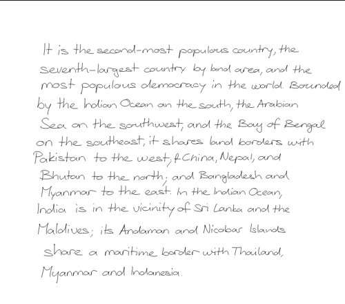

# Handwriting Syntheis
Credits for this project goes to [https://github.com/sjvasquez/handwriting-synthesis](https://github.com/sjvasquez/handwriting-synthesis)

I just dockerised it and modified so to use it for my assignments.

## To run

Clone the repo

```docker compose up -d```

Then

```docker exec -it container_hash /bin/bash # here container_hash can be obtained from docker ps```

Write whatever text you want in test.txt

A file img/compiled.pdf will contain required text

```python demo.py```
- It will generate text from test.txt
- Inside img folder everything will be generated

Everything is volume mapped so enjoy

## Effective Usage
I used it for theoritical assignments for which I got the content online. An easy way is to print the pages, draw margins and then scan it using CamScanner B/W mode.



